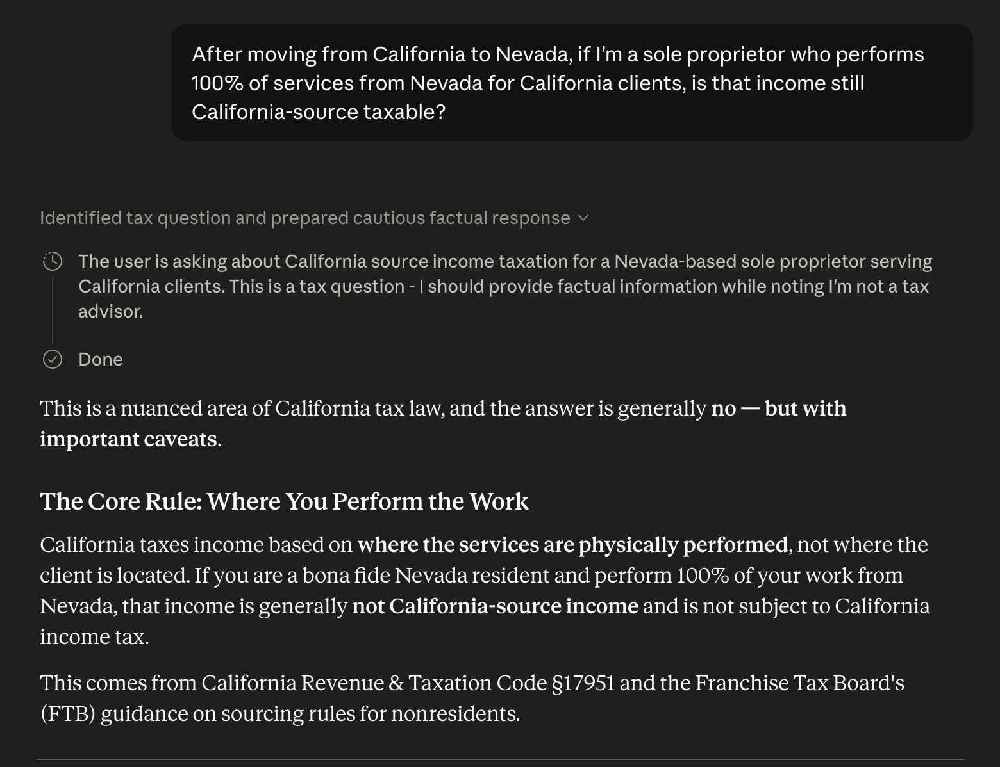
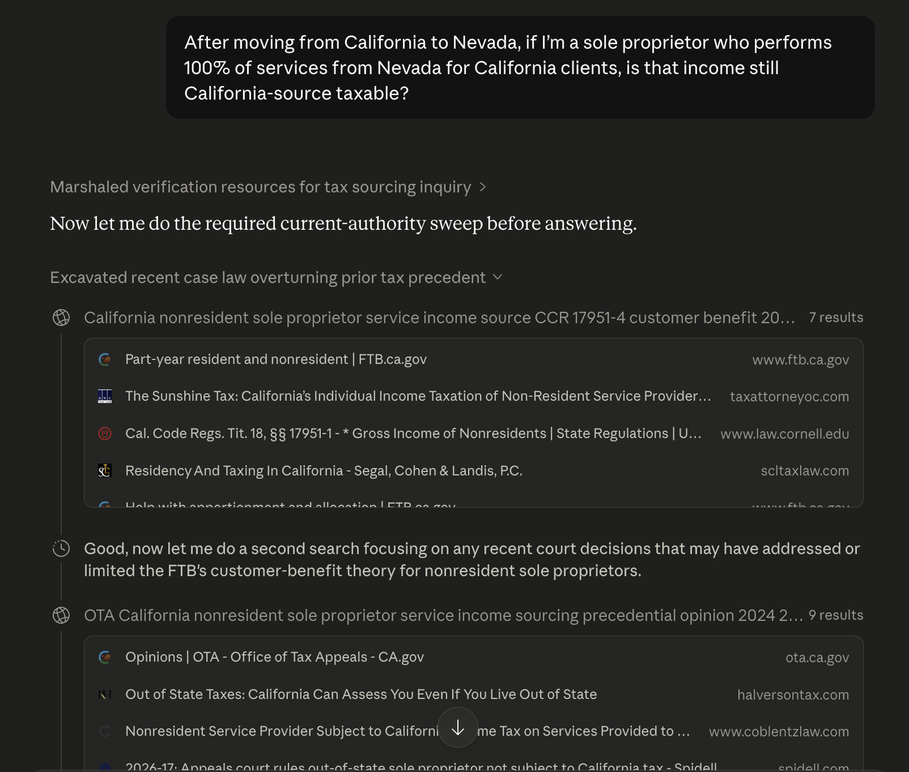

# California Tax Authority Skill

Turn Claude into a **California tax research copilot** that is concise, current-authority-first, and source-backed.

## Before vs After

Prompt example:

- `After moving from California to Nevada, if I’m a sole proprietor who performs 100% of services from Nevada for California clients, is that income still California-source taxable?`

Visual comparison:

| Before (no skill) | After (with skill) |
|---|---|
|  |  |

| Before (no skill) | After (with skill) |
|---|---|
| Hard yes/no first | Risk-aware `Bottom Line` first |
| Can miss latest authority | Forces fresh sweep for `still/latest/current` |
| Long legal blocks | `3 key points + what to do now` first |
| Repeated disclaimers | One concise disclaimer block |
| Mixed source quality | Court/reg/statute first, commentary labeled |

<details>
<summary><strong>Open Before Raw Sample</strong></summary>

```text
Generally no - but with caveats.
Core rule emphasized physical work location (Nevada).
Main focus: residency proof, CA travel days, and documentation.
Result style: readable, but can be over-confident when authority is shifting.
```

</details>

<details>
<summary><strong>Open After Raw Sample</strong></summary>

```text
Uses a current-authority sweep before final conclusion.
Highlights Garcia-Rojas (May 1, 2026) and its limits.
Keeps risk framing: not a simple yes/no, facts + posture matter.
Result style: better authority discipline, but can become verbose.
```

</details>

## Cross-Model Benchmark (Single Prompt Snapshot)

Scope:

- Single test prompt on California nonresident sole-proprietor sourcing (`Garcia-Rojas` scenario)
- Snapshot date: `2026-05-11`
- This is not a universal ranking across all tax questions

| System | Current-authority handling | Authority discipline | Readability | Risk framing | Snapshot result |
|---|---|---|---|---|---|
| Gemini Pro | Medium | Medium | High | Medium | Solid summary; may miss deeper legal conflict handling |
| GPT 5.5 Thinking | Medium | High | High | High | Strong structure; freshness depends on case sweep quality |
| BlueJ | Low-Medium | Medium | Medium | Low-Medium | Can be decisive, but may overstate one theory |
| Claude (without skill) | Medium | Medium | High | Medium | Clear for general users; can under-handle shifting authority |
| Claude (with this skill) | High | High | High | High | Best balance on this prompt (freshness + authority + practical format) |

<details>
<summary><strong>Open Short Excerpts by System</strong></summary>

```text
Gemini Pro:
"Generally not simply because clients are in California, but this is a newly shifting area."

GPT 5.5 Thinking:
"W-2 wages are sourced by where physically worked; 1099/Schedule C often by customer benefit."

BlueJ:
"Generally not California-source if 100% performed in Nevada." (physical-performance heavy)

Claude without skill:
"Generally no — but with important caveats." (good readability, weaker conflict handling)

Claude with skill:
"Filing-risk question; run current-authority sweep; separate residency from sourcing."
```

</details>

## What You Get

- Clear first-screen format: `Bottom Line -> 3 key points -> What To Do Now`
- Better freshness control for time-sensitive questions
- Stronger source discipline (official sources first)
- Cleaner tone (less process narration, less repetition)

## Quick Setup

### Claude App
1. Enable code/file capability.
2. Customize -> Skills -> Upload skill zip.
3. Enable skill and ask questions normally.

### Claude Code
1. Put this folder at `.claude/skills/california-tax-authority/` (project) or `~/.claude/skills/california-tax-authority/` (global).
2. Ask normally or invoke `/california-tax-authority`.

## Skill Files

- `.claude/skills/california-tax-authority/SKILL.md`
- `.claude/skills/california-tax-authority/GUIDELINES.md`
- `.claude/skills/california-tax-authority/references/authority-framework.md`
- `.claude/skills/california-tax-authority/examples/prompt-examples.md`

## Closing Note
Do you want a SOC2-compliant, BlueJ-level California + Federal tax research engine? Reach out to `support@wesley-ai.co`
